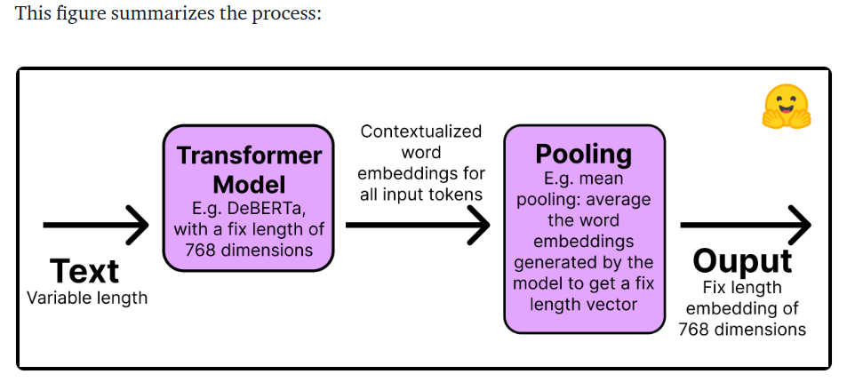

# FAQ-bot-using-bert sentence transformers

I had csv file of Frequently asked Questions and answers. <b> My problem statement is choose/find similar question based on user input question. </b> sentence-transformers is a library that provides easy methods to compute embeddings (dense vector representations) for sentences, paragraphs and images. Texts are embedded in a vector space such that similar text is close, which enables applications such as semantic search, clustering, and retrieval.

## Working:-

Why we use Sentence Transformers instead of BERT or Roberta Transformers?

i) Pre-trained Transformers require heavy computation to perform semantic search tasks. For example, finding the most similar pair in a collection of 10,000 sentences requires about 50 million inference computations (~65 hours) with BERT. In contrast, a BERT Sentence Transformers model reduces the time to about 5 seconds.
ii) Once trained, Transformers create poor sentence representations out of the box. A BERT model with its token embeddings averaged to create a sentence embedding performs worse than the GloVe embeddings developed in 2014.

## How to prepare your dataset for Fine-tunning a Sentence Transformers model?

To Finetune a Sentence Transformers model, you need to inform it somehow that two sentences have a certain degree of similarity. Therefore, each example in the data requires a label or structure that allows the model to understand whether two sentences are similar or different.

Most dataset configurations will take one of four forms (below you will see examples of each case):

 Case 1: The example is a pair of sentences and a label indicating how similar they are. The label can be either an integer or a float. This case applies to datasets originally prepared for Natural Language Inference (NLI), since they contain pairs of sentences with a label indicating whether they infer each other or not. 

 Case 2: The example is a pair of positive (similar) sentences without a label. For example, pairs of paraphrases, pairs of full texts and their summaries, pairs of duplicate questions, pairs of (query, response), or pairs of (source_language, target_language). Natural Language Inference datasets can also be formatted this way by pairing entailing sentences. Having your data in this format can be great since you can use the MultipleNegativesRankingLoss, one of the most used loss functions for Sentence Transformers models. 

 Case 3: The example is a sentence with an integer label. This data format is easily converted by loss functions into three sentences (triplets) where the first is an "anchor", the second a "positive" of the same class as the anchor, and the third a "negative" of a different class. Each sentence has an integer label indicating the class to which it belongs. 

 Case 4: The example is a triplet (anchor, positive, negative) without classes or labels for the sentences. 

## Here My problem statement belongs to case 2 where i dont have labels.

The next step is converting the dataset into a format the Sentence Transformers model can understand. 

## Loss functions for training a Sentence Transformers model?

Each will have a different loss function associated with it.

 Case 1: Pair of sentences and a label indicating how similar they are. The loss function optimizes such that (1) the sentences with the closest labels are near in the vector space, and (2) the sentences with the farthest labels are as far as possible. The loss function depends on the format of the label. If its an integer use ContrastiveLoss or SoftmaxLoss; if its a float you can use CosineSimilarityLoss. 

 Case 2: If you only have two similar sentences (two positives) with no labels, then you can use the MultipleNegativesRankingLoss function. The MegaBatchMarginLoss can also be used, and it would convert your examples to triplets (anchor_i, positive_i, positive_j) where positive_j serves as the negative. 

 Case 3: When your samples are triplets of the form [anchor, positive, negative] and you have an integer label for each, a loss function optimizes the model so that the anchor and positive sentences are closer together in vector space than the anchor and negative sentences. You can use BatchHardTripletLoss, which requires the data to be labeled with integers (e.g., labels 1, 2, 3) assuming that samples with the same label are similar. Therefore, anchors and positives must have the same label, while negatives must have a different one. Alternatively, you can use BatchAllTripletLoss, BatchHardSoftMarginTripletLoss, or BatchSemiHardTripletLoss. The differences between them is beyond the scope of this tutorial, but can be reviewed in the Sentence Transformers documentation. 

 Case 4: If you don't have a label for each sentence in the triplets, you should use TripletLoss. This loss minimizes the distance between the anchor and the positive sentences while maximizing the distance between the anchor and the negative sentences. 

## What are the limits of Sentence Transformers?
Sentence Transformers models work much better than the simple Transformers models for semantic search. However, where do the Sentence Transformers models does not work well If your task is classification, then using sentence embeddings is the wrong approach. In that case, the 🤗 Transformers library would be a better choice.
